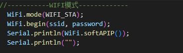
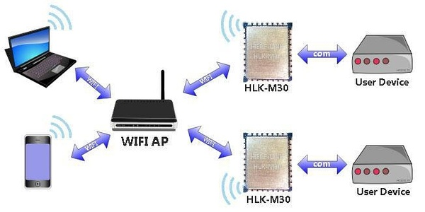

ESP8266WebServer
======

>本仓库是`食物热量识别系统`的网页数据显示部分
>
>**ESP8266作为服务器**，向链接到该IP的终端发送HTML网页
>
>ESP8266WebServer是基于ESP8266开发板的演示代码，平台是Arduino，根据ESP8266示例代码HelloServer改变，使用了HTML异步控制引脚，异步获取模拟量数据显示在居于`echarts`的图表（调用了[百度的API]([Apache ECharts](https://echarts.apache.org/zh/index.html)) ）上
>
>ESP8266通过UART与单片机进行数据传输


## 文件目录表

HelloServer
> HelloServer.ino

HTML
> main_page.html


## 环境搭建
1. 在 [Arduino官网](https://www.arduino.cc/en/Main/Software?setlang=cn&setlang=cn) 下载IDE软件

2. 安装后点击 **文件 -> 首选项** 在 **附加开发板管理器网站**中把 *http://arduino.esp8266.com/stable/package_esp8266com_index.json* 添加上。点击“好”

3. 在 **工具->开发板：？？？？->开发板管理器** 中搜索 **esp8266** 

4. 把包安装上就可以了

   

## 程序结构解释
>基于arduino的框架编写

#### setup函数：
* part1：WIFI模式设定

设置WiFi为STA模式，STA模式需要电脑与ESP8266连接同一个WiFi（或者手机热点）进行数据传输

宏定义 STASSID STAPSK 指定热点id以及密码


* part 2: 检查连接
  检查esp是否连接上WiFi，连接成功后，串口监视器会打印出**服务器的ip地址**，在浏览器打开该ip地址，可以看到服务器发送的HTML(一串字符串)，浏览器会对其进行解析，以网页的形式呈现

* part 3：路由

  > server.on("/", handleRoot);

  主页的服务程序（句柄）是handleRoot函数，该函数(ResponseHTML)向设备发送html网页

#### Loop函数

>注：esp8266硬串口只有一个(uart0)能收发数据，但是已经被占用，但是可以通过配置`软串口`的方式，将别的闲置引脚设置成串口

```C
void loop(void) {
  server.handleClient();
  MDNS.update();
  if ( myserial.available()>0 ) {    // 判断软串口是否传输数据进来，如有则进行分析
    int pos = myserial.parseInt();   // 解析软串口数据中的整数信息并赋值给变量pos
    if(pos!=0)
    {
        //从主核uart发送的数据中提取数据
    	Serial.print("data from e203:");
    	Serial.println(pos);
    	kind_int = (int)(pos/1000);    //食物种类
    	weight   = pos - 1000*kind_int;//重量
        
    	Serial.print("[info] weight from E203: ");
    	Serial.println(weight);           
    	Serial.print("[info] kind from E203: ");
    	Serial.println(kind_int);
        
        //数据更新
    	update_data(kind_int,weight); //更新数据
    	responseHtml(html1);  		  //将更新后的html网页发送出去
    }
    delay(15);
  }
}
```


## 核心函数、变量解释

|变量名|释义|
|---|---|
|html1|html代码格式化后的前面一部分|
|STASSID|WiFi账号|
|STAPSK|WiFi密码|

* add_object()
>该函数负责将HTML网页里面的变量进行更新，重新合成为新的html网页字符串，返回新的html字符串
>
>格式化html网站：[格式化HTML](https://www.sojson.com/jshtml.html)具体教程见下文

* responseHtml ()
>发送html网页的函数
>server.send(200, "text/html", add_object());
>200为端口，"text/html"指定为html类型，add_object()处的参数是html压缩+转义后的字符串


## 格式化HTML

* step1 把html代码全部复制粘贴到这个框里面,点击**普通压缩**

  

* step2 转义处理

  因为 `"` 这个符号在C语言中需要转义处理，因此将上面生成的压缩后的html复制到记事本或者别的文本工具，把 `"` 替换成 `\"`

* step3 变量拆分

  现在得到的字符串可以在代码里面用String类型变量表示了，但是为了变量可以更改（而不是一个静态的字符串），就需要前面说的add_object()函数，将需要的变量拆出来表示，具体可以看代码

## 服务器与终端数据传输

* 终端--->服务器：

<a href>字段中定义了两个按钮，**onclick**字段指定按下按钮会触发函数 **local(pin, status)**，向服务器发送pin和status两个变量

```HTML
<script>
	function local(pin,staut)
	{
		var xmlhttp=new XMLHttpRequest();
		xmlhttp.open("GET","/pin?pin="+pin+"&light="+staut,true);
		xmlhttp.send()
	}	
</script>
```

```HTML
	<a href="#"onclick="local(1,'on')"><input type="button"value="reset"style="font-size: 24px; padding: 10px; margin: auto 10px ;"></a>
	<a href="#"onclick="local(1,'off')"><input type="button"value="start"style="font-size: 24px; padding: 10px; margin: auto 10px; float: right;"></a>
```
pin函数负责解析终端发来的pin变量

```C
void pin() {
  String data = server.arg("pin"); //解析pin变量
  switch(data[0]) {
    case '1':
      controller(PIN_LIGHT1);break;
    case '2':
      controller(PIN_LIGHT2);break;
    case '3':
      controller(PIN_LIGHT3);break;
    case '4':
      controller(PIN_LIGHT4);break;
  }
}
```


* 服务器--->终端

  responseHtml() 函数


## 其他
因为是静态界面，需要手动点击浏览器刷新按钮才能刷新，(可以设置定时刷新，但是效果不好看，pass)，单纯用html应该无法解决这个问题

